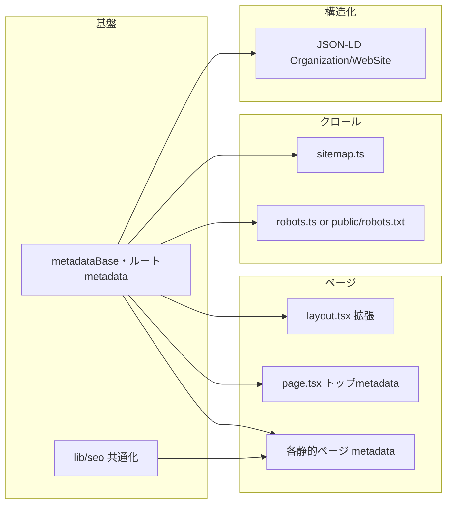

# プロジェクト全体の SEO 強化プラン

## 現状

- **ルート** ([app/layout.tsx](app/layout.tsx)): `title` と `description` のみ。OG/Twitter/Canonical なし。
- **静的ページ** (about-us, company, contact, privacy, recruit, service): 各ページで `title`・`description` あり。OG/Twitter/Canonical なし。
- **トップ** ([app/page.tsx](app/page.tsx)): メタデータ未定義（ルートを継承）。
- **サイトマップ・robots**: 未実装（`app/sitemap.ts` / `app/robots.ts` も `public/` 内のファイルもなし）。
- **構造化データ**: JSON-LD 未使用。
- **ビルド**: `output: 'export'`（静的エクスポート）。`trailingSlash: true` のため URL は末尾スラッシュ付き。

---

## 1. ルートメタデータの拡張

**対象**: [app/layout.tsx](app/layout.tsx)

- **metadataBase**: 本番ドメイン `**https://our-desk.co.jp**` を設定。Canonical と OG 画像の絶対 URL に使用。
- **title**: `default` と `template: '%s | OurDesk株式会社'` を設定し、子ページは「ページ名 | OurDesk 株式会社」に統一。
- **description**: 現状の文言を維持または少し拡張。
- **openGraph**: `title`, `description`, `type: 'website'`, `locale: 'ja_JP'`, `siteName`。`metadataBase` があれば OG 画像（例: `/OurDesk_logo.png`）を絶対 URL で指定。
- **twitter**: `card: 'summary_large_image'`, `title`, `description`。
- **robots**: `index, follow`（必要に応じて後で変更）。
- **alternates.canonical**: ルートでは不要（各ページで設定するため）。

トップページ ([app/page.tsx](app/page.tsx)) で `metadata` を export し、`title: 'OurDesk株式会社'`（テンプレートを使わない場合のトップ用）と `description` を明示すると、一貫したタイトル・説明文になる。

---

## 2. 各静的ページのメタデータ統一

**対象**: [app/(static)/about-us/page.tsx](<app/(static)/about-us/page.tsx>), [app/(static)/company/page.tsx](<app/(static)/company/page.tsx>), [app/(static)/contact/page.tsx](<app/(static)/contact/page.tsx>), [app/(static)/privacy/page.tsx](<app/(static)/privacy/page.tsx>), [app/(static)/recruit/page.tsx](<app/(static)/recruit/page.tsx>), [app/(static)/service/page.tsx](<app/(static)/service/page.tsx>)

- 現状の `title` / `description` を維持しつつ、以下を追加:
  - **openGraph**: `title`, `description`, `url`（canonical と同一）。必要なら `type: 'website'`。
  - **alternates.canonical**: 当該ページの絶対 URL（`metadataBase` + パス。`trailingSlash: true` なら末尾スラッシュ付き）。

共通化する場合は、`lib/seo.ts` などで「パス・title・description を受け取り Metadata を返す」関数を用意し、各ページでそれを利用する形にするとよい。

---

## 3. サイトマップの追加

**方式**: App Router の [app/sitemap.ts](app/sitemap.ts) を追加（Next.js がビルド時に静的エクスポートでも sitemap を生成する想定）。

- **URL 一覧**: `/`, `/about-us/`, `/company/`, `/contact/`, `/privacy/`, `/recruit/`, `/service/`（`trailingSlash: true` に合わせる）。
- **各エントリ**: `url`（絶対 URL）、`lastModified`（例: `new Date()`）、`changeFrequency`、`priority`（トップは 1.0、他は 0.8 など）。
- **ベース URL**: `**https://our-desk.co.jp**`（`metadataBase` と同一）。

静的エクスポートで `sitemap.ts` がビルドエラーになる場合は、`public/sitemap.xml` を手動で用意する代替案を検討する。

---

## 4. robots.txt の追加

**方式**: [app/robots.ts](app/robots.ts) を追加し、`allow: '/'`、`sitemap: '{ベースURL}/sitemap.xml'` を返す。

- Next.js 15 では `output: 'export'` 時に `robots.ts` でビルドエラーになる事例があるため、ビルドが失敗する場合は [public/robots.txt](public/robots.txt) を静的ファイルとして配置する方針にする。
- 本番ドメイン **our-desk.co.jp** で、`User-agent: *`、`Allow: /`、`Sitemap: https://our-desk.co.jp/sitemap.xml` を記載。

---

## 5. 構造化データ（JSON-LD）の追加

**対象**: ルートレイアウトまたはトップページ

- **Organization**: 会社名、URL、ロゴ、連絡先（必要なら）を [schema.org/Organization](https://schema.org/Organization) 形式で出力。
- **WebSite**: サイト名、URL、`potentialAction` で SearchAction を付与するかは任意（検索窓がない場合は省略可）。

実装方法: [app/layout.tsx](app/layout.tsx) の `<head>` 内に、`<script type="application/ld+json">` で JSON を埋め込む。Next.js では `metadata` だけでは JSON-LD を出せないため、レイアウトで直接 `<script>` を書くか、`components/JsonLd.tsx` のようなコンポーネントで組織・サイト情報を返し、レイアウトで読み込む。

---

## 6. その他の確認・推奨

- **404**: [app/not-found.tsx](app/not-found.tsx) はメタデータを export できないため、今回の対象外でよい。
- **画像**: [components/Header.tsx](components/Header.tsx) と [components/Footer.tsx](components/Footer.tsx) の `Image` にはすでに `alt="OurDesk株式会社"` が付いているため、そのまま利用可能。
- **言語**: ルートの `<html lang="ja">` は設定済み。
- **本番 URL**: サイトマップ・robots・Canonical・OG のベース URL は `**https://our-desk.co.jp**` で統一する。

---

## 7. README.md の更新

**対象**: [README.md](README.md)

SEO 対応を反映し、運用・デプロイ時の参照用に以下を追記・修正する。

- **本番 URL の明記**: 「ビルドとデプロイ」または冒頭付近で、本番サイト **[https://our-desk.co.jp](https://our-desk.co.jp)** を記載する（任意だが推奨）。
- **SEO セクションの追加**: 新規セクション「SEO」を設け、次の内容を簡潔に記載する。
  - メタデータ: 各ページの title・description、OG/Twitter カード、canonical（ベース URL: `https://our-desk.co.jp`）。
  - サイトマップ: `app/sitemap.ts` によりビルド時に `/sitemap.xml` が生成されること。静的エクスポート時は `out/sitemap.xml` に含まれること。
  - robots.txt: `app/robots.ts` により `/robots.txt` が生成されること（または `public/robots.txt` を利用する場合の記載）。
  - 構造化データ: Organization および WebSite の JSON-LD をルートで出力していること。
- **プロジェクト構造の更新**: `app/sitemap.ts`、`app/robots.ts`、および作成した場合は `lib/seo.ts`・`components/JsonLd.tsx` を一覧に追加する。
- **デプロイチェックリストの更新**: デプロイ後の確認事項に「`/sitemap.xml` および `/robots.txt` が正しく配信されること」を追加する（任意）。

---

## 実装の依存関係

---

## 変更ファイル一覧（想定）

| 種別         | ファイル                                                                                                                        |
| ------------ | ------------------------------------------------------------------------------------------------------------------------------- |
| ルート       | [app/layout.tsx](app/layout.tsx)                                                                                                |
| トップ       | [app/page.tsx](app/page.tsx)                                                                                                    |
| 共通         | 新規: `lib/seo.ts`（任意）                                                                                                      |
| 静的ページ   | [app/(static)/about-us/page.tsx](<app/(static)/about-us/page.tsx>), company, contact, privacy, recruit, service の各 `page.tsx` |
| サイトマップ | 新規: [app/sitemap.ts](app/sitemap.ts)                                                                                          |
| robots       | 新規: [app/robots.ts](app/robots.ts) または [public/robots.txt](public/robots.txt)                                              |
| JSON-LD      | [app/layout.tsx](app/layout.tsx) 内、または新規: `components/JsonLd.tsx`                                                        |
| ドキュメント | [README.md](README.md)                                                                                                          |

**本番ドメイン**: `https://our-desk.co.jp`（実装時はこの値で metadataBase・sitemap・robots・canonical を設定する）。
